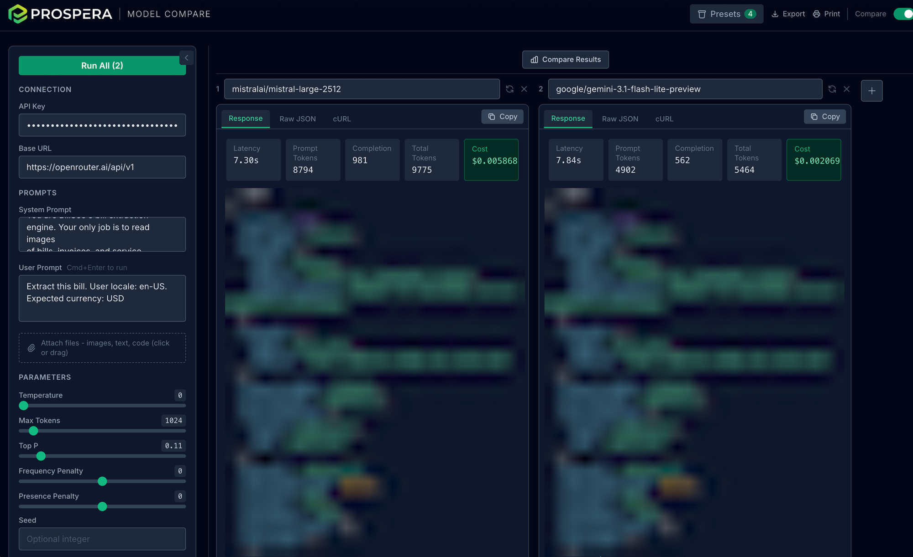

# Prospera Model Compare
by [Prospera Lab](https://prosperalab.xyz/)




A local, browser-based playground for testing OpenAI-compatible chat completion APIs. No backend required - your browser calls the target API directly. All settings and responses are saved in `localStorage`.

## What you can do

**Test a prompt against any model** - paste in a system and user prompt, pick a model, hit Run. See the response, latency, and token counts in seconds.

**Tune generation parameters** - dial in temperature, max tokens, top P, frequency penalty, presence penalty, and seed to understand exactly how each one affects the output.

**Attach files to your prompt** - drag and drop images (JPEG, PNG, GIF, WebP) or text-based files (code, markdown, CSV, JSON, logs, and more) to include them as multimodal context. Up to 20 MB per file.

**Force structured output** - choose JSON Object mode to get valid JSON back, or define a JSON Schema and the model will conform its output to your exact shape.

**Compare models side by side** - switch to Compare mode, add columns, and run the same prompt across multiple models in parallel. Useful for choosing a model, auditing quality regressions, or benchmarking cost vs. quality.

**Inspect the raw API response** - the Raw JSON tab shows the full response body so you can see finish reasons, token counts, and any provider-specific fields.

**Export as a cURL command** - every run generates an equivalent `curl` command (API key masked) you can copy and share or drop into a script.

**Save and restore sessions** - Presets capture everything: mode, model selections, parameters, prompts, and responses. Reload any past session exactly as you left it, including the results.

**Work with any OpenAI-compatible provider** - OpenRouter, OpenAI, Groq, Ollama, or any custom endpoint. Just change the base URL.

**Stay in flow** - settings persist across reloads, the panel collapses to maximize output space, and Cmd+Enter submits from the prompt field.

## Features

- **Full parameter control** - temperature, max tokens, top P, frequency/presence penalty, seed
- **Response format** - plain text, JSON object, or structured JSON schema output
- **Raw response inspection** - view the full JSON body returned by the API
- **cURL export** - get an equivalent `curl` command for any request (API key masked)
- **Model search** - search across all available OpenRouter models by name or ID with pricing info
- **Compare mode** - run the same prompt across multiple models side by side
- **Presets** - save and reload full configurations including model selections and responses
- **Collapsible settings panel** - maximize output space when you don't need the controls visible
- **Persistence** - all settings (except the user prompt) survive page reloads via localStorage

## Supported Providers

Any OpenAI-compatible `/chat/completions` endpoint works. Tested with:

| Provider | Base URL |
|----------|----------|
| OpenRouter | `https://openrouter.ai/api/v1` (default) |
| OpenAI | `https://api.openai.com/v1` |
| Groq | `https://api.groq.com/openai/v1` |
| Ollama | `http://localhost:11434/v1` (no API key needed) |
| Any other OpenAI-compatible API | custom URL |

## Getting Started

**Requirements:** Node.js 18+

```bash
npm install
npm run dev
```

Open [http://localhost:3000](http://localhost:3000).

## Usage

### Single mode

1. Enter your API key and base URL in the left panel
2. Pick a model - start typing to search OpenRouter models, or paste any model ID
3. Write a system prompt (optional) and user prompt
4. Adjust parameters with the sliders
5. Click **Run** or press **Cmd+Enter**

The right panel shows three tabs:
- **Response** - token usage, latency, and the model's reply
- **Raw JSON** - the full API response body
- **cURL** - a copy-pasteable `curl` command (API key is masked)

Click **Copy** on any tab to copy its content to the clipboard.

### Compare mode

Toggle **Compare** in the header to run the same inputs across multiple models at once.

- The left panel holds all shared settings (API key, base URL, prompts, parameters)
- Each column has its own model selector - search or type a model ID
- Click **+** to add more columns; click **x** to remove one
- **Run All** fires all models in parallel
- Results render side by side in a horizontally scrollable view

### Presets

Click **Presets** in the header to open the preset manager.

- **Save current** - name and save the entire current state (mode, all settings, all models, responses)
- Click any saved preset to restore it instantly, including switching between single and compare mode
- Hover a preset to rename (pencil icon) or delete (trash icon)
- Presets include response results, so you can reload a previous session exactly as you left it

### Collapsing the settings panel

Click the **`<`** button at the top-right of the settings panel to collapse it and give more space to the output. Click **`>`** to expand it again.

## Project Structure

```
app/
  layout.tsx          root layout (Inter font, dark base)
  page.tsx            main page - single/compare mode toggle, preset wiring
  globals.css         Tailwind base styles

components/
  ConfigPanel.tsx         left settings panel (connection, prompts, sliders, response format)
  OutputPanel.tsx         three-tab output panel (Response / Raw JSON / cURL)
  CompareView.tsx         multi-model comparison layout
  ModelSearch.tsx         searchable model combobox backed by OpenRouter models API
  PresetsPanel.tsx        save/load/rename/delete presets dropdown
  ExpandableTextarea.tsx  auto-growing textarea for prompts
  FileAttachments.tsx     file attachment picker and display
  Slider.tsx              reusable labeled range slider

lib/
  api.ts              RequestConfig type, buildPayload, buildCurl, runCompletion
  storage.ts          localStorage helpers for live config persistence
  presets.ts          preset types and localStorage helpers
```

## Tech Stack

- [Next.js 14](https://nextjs.org/) (App Router)
- [TypeScript](https://www.typescriptlang.org/)
- [Tailwind CSS](https://tailwindcss.com/)
- No external state library - React `useState` only
- No backend - all API calls made directly from the browser
